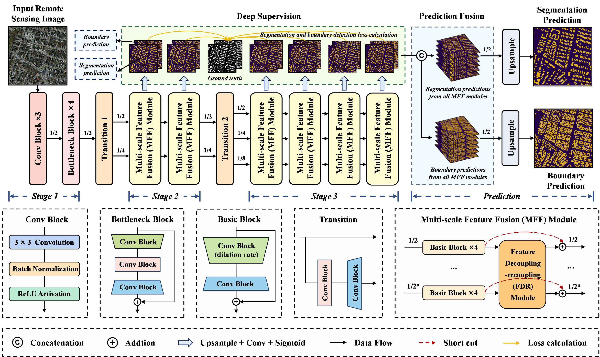

# HD-Net: High-Resolution Decoupled Network for Building Footprint Extraction via Deeply Supervised Body and Boundary Decomposition

Yuxuan Li, [Danfeng Hong](https://scholar.google.com/citations?user=n7gL0_IAAAAJ&hl=en), Chenyu Li, [Jing Yao](https://scholar.google.com/citations?user=1SHd5ygAAAAJ&hl=en), [Jocelyn Chanussot](https://scholar.google.com/citations?user=6owK2OQAAAAJ&hl=en)

___________

The code in this toolbox implements the ["HD-Net: High-Resolution Decoupled Network for Building Footprint Extraction via Deeply Supervised Body and Boundary Decomposition"](https://authors.elsevier.com/a/1iYW63I9x1qnCx).

The motivation of image-level and feature-level decoupling in building footprint extraction. 

The architecture of the proposed HD-Net.

Citation
---------------------

**Please kindly cite the papers if this code is useful and helpful for your research.**

Yuxuan Li, Danfeng Hong, Chenyu Li, Jing Yao, Jocelyn Chanussot. HD-Net: High-Resolution Decoupled Network for Building Footprint Extraction via Deeply Supervised Body and Boundary Decomposition. ISPRS Journal of Photogrammetry and Remote Sensing, 2024, 209: 51-65. 

     @article{hong2024HD,
     title={HD-Net: High-Resolution Decoupled Network for Building Footprint Extraction via Deeply Supervised Body and Boundary Decomposition},
     author={Li, Yuxuan and Hong, Danfeng and Li, Chenyu and Yao, Jing and Chanussote, Jocelyn},
     journal={ISPRS Journal of Photogrammetry and Remote Sensing},
     volume={209},
     pages={51-65},
     year={2024}
     }

System-specific notes
---------------------
Please refer to the file `requirements.txt` for the running environment of this code.

:exclamation: The pretrained model and datasets can be downloaded from the following links:

Licensing
---------

Copyright (C) 2024 Danfeng Hong

This program is free software: you can redistribute it and/or modify it under the terms of the GNU General Public License as published by the Free Software Foundation, version 3 of the License.

This program is distributed in the hope that it will be useful, but WITHOUT ANY WARRANTY; without even the implied warranty of MERCHANTABILITY or FITNESS FOR A PARTICULAR PURPOSE. See the GNU General Public License for more details.

You should have received a copy of the GNU General Public License along with this program.

Contact Information:
--------------------

Danfeng Hong: hongdanfeng1989@gmail.com 
Danfeng Hong is with the Aerospace Information Research Institute, Chinese Academy of Sciences, 100094 Beijing, China.
